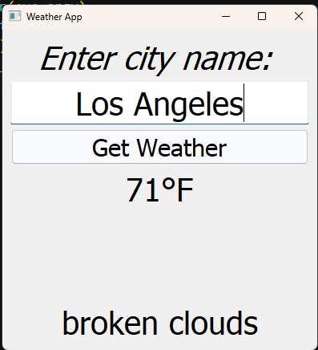

## Author

Built by Jayvion Williams

GitHub: https://github.com/jayhs0

# Weather App (PyQt5)

A simple desktop weather application built with **Python + PyQt5** that fetches real-time weather data using the **OpenWeather API**.
<p align="center">
  
</p>

---

## Features

- Search weather by city name  
- Real-time temperature display (°F)  
- Weather description (clear, cloudy, rain, etc.)  
- Error handling for:
  - Invalid city names  
  - No internet connection  
  - API errors  
- Clean PyQt5 graphical interface  

---

## Tech Stack

- Python 3  
- PyQt5 (GUI)  
- Requests (API calls)  
- OpenWeather API  

---

## API Key Setup

This project uses the **OpenWeather API**.

### Step 1:
Get a free API key here:  
https://openweathermap.org/api

### Step 2:
Open `config.py` and add your key:

```python
API_KEY = "your_api_key_here"